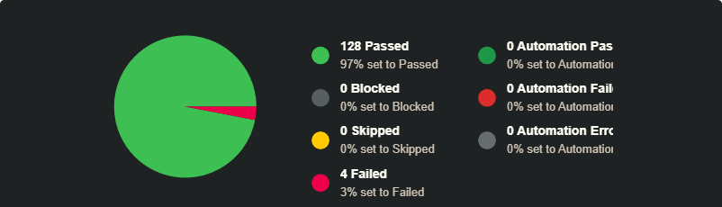

# Test Run Summary – Sauce Demo

## Test Run

**Sauce Demo Manual Regression Test Run**

## Scope

- Login Page
- Products Page
- Shopping Cart Page
- Checkout Process

## Test Environment

- **Application:** Sauce Demo
- **Browser:** Google Chrome
- **OS:** Windows 11
- **Tester:** Amal Kamalov
- **Test Date:** [add date]

## Execution Summary

| Status | Count | Percentage |
|---|---:|---:|
| Passed | 128 | 97% |
| Failed | 4 | 3% |
| Blocked | 0 | 0% |
| Skipped | 0 | 0% |
| Untested | 0 | 0% |
| **Total** | **132** | **100%** |

## Defects Found

| Bug ID | Summary | Severity | Priority | Related Test Case | Jira Issue |
|---|---|---|---|---|---|
| BUG-001 | Product buttons remain in `Remove` state after `Reset App State` | Major | Medium | C194 | QSD-[add ID] |
| BUG-002 | Cart items remain visible after `Reset App State` on Cart page | Major | [add priority] | C317 | QSD-[add ID] |
| BUG-003 | User can complete checkout with an empty cart | Major | Medium | C308 | QSD-7 |
| BUG-004 | User can access order confirmation page directly without completing checkout | Major | Medium | C300 | QSD-8 |

## TestRail Evidence

## Export

[Test Run Results CSV](test-run-results.csv)

## Summary

The executed test run covered the main Sauce Demo user flows: authentication, product catalog, shopping cart, and checkout process.

Most core functionality worked as expected. Failed tests were related mainly to cart/reset state synchronization and checkout flow validation.
