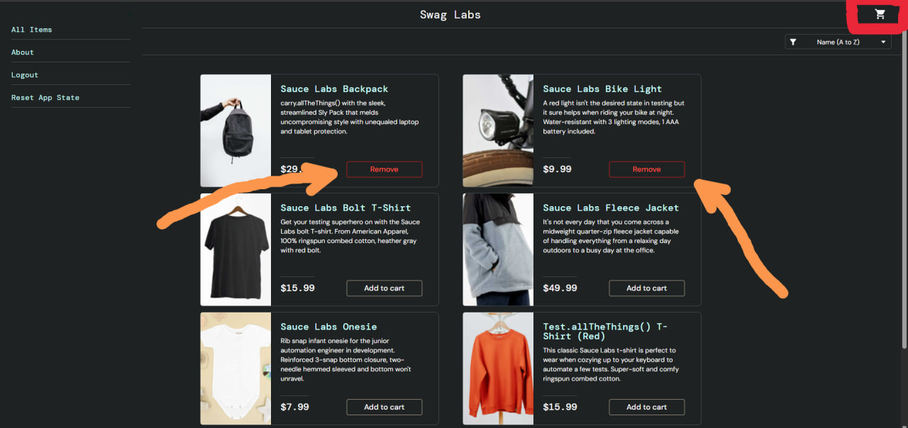
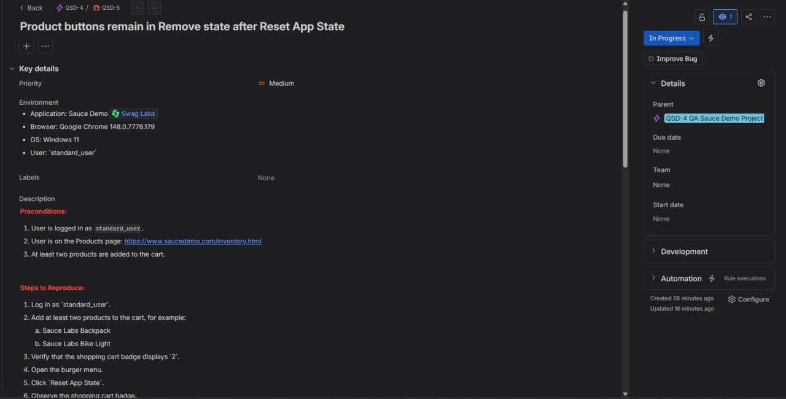
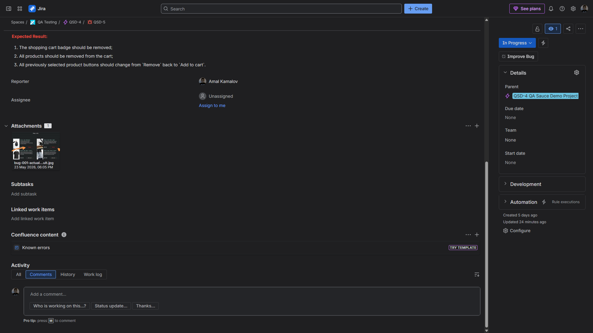

# Bug Report: Product buttons remain in `Remove` state after `Reset App State`

**Bug ID:** BUG-001  
**Severity:** Major  
**Priority:** High  
**Type:** Functional bug  
**Related Test Case:** C194 — Verify Reset App State Clears Cart State

## Summary
After clicking `Reset App State` from the burger menu, the shopping cart badge is removed, but previously added product buttons remain in the `Remove` state instead of changing back to `Add to cart`.

## Environment
- **Application:** Sauce Demo
- **URL:** https://www.saucedemo.com/inventory.html
- **Browser:** Google Chrome (latest version)
- **OS:** Windows 11
- **User:** `standard_user`

## Preconditions
- User is logged in as `standard_user`
- At least two products are added to the cart
- User is on the **Products** page

## Steps to Reproduce
1. Verify that the cart badge displays the correct item count
2. Open the burger menu
3. Click `Reset App State`
4. Observe the button state for previously added products

## Expected Result
After clicking `Reset App State`:
- the shopping cart badge should be removed
- all previously added products should be removed from the cart
- all product buttons should change from `Remove` to `Add to cart`

## Actual Result
After clicking `Reset App State`, the shopping cart badge is removed, but previously added products still display the `Remove` button.

## Notes
This creates an inconsistent UI state:
- the cart badge indicates that the cart is empty
- product buttons still indicate that items remain in the cart

## Attachment
Screenshot showing `Remove` buttons still visible after `Reset App State` while the cart badge is already cleared.

## Jira Evidence

**Jira Issue:** QSD-5  
**Status:** In Progress  
**Priority:** Medium  
**Parent:** QSD-4 — QA Sauce Demo Project

