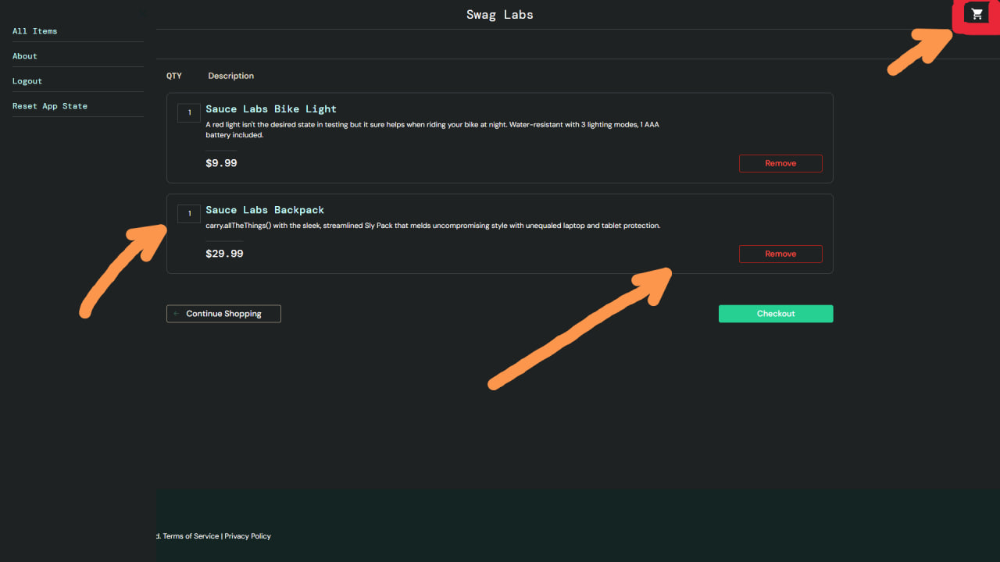
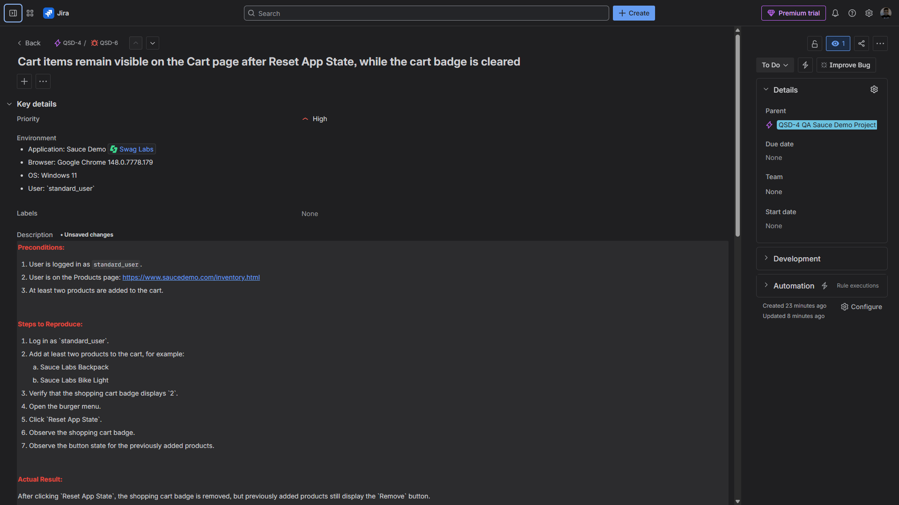
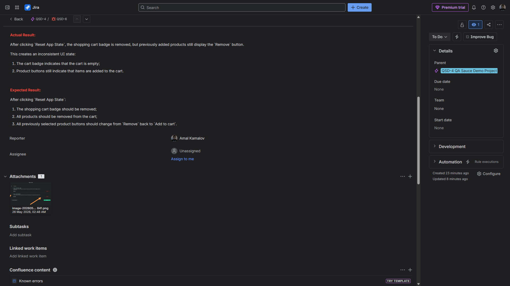

# Bug Report: Cart items remain visible after `Reset App State` on Cart page

**Bug ID:** BUG-002  
**Severity:** Major  
**Priority:** High  
**Type:** Functional bug  
**Related Test Case:** C317 — Verify Reset App State Clears Cart Items on Cart Page

## Summary
After clicking `Reset App State` from the burger menu on the Cart page, the shopping cart badge is removed. Still, previously added products remain visible in the cart item list without refreshing the page.

## Environment
- **Application:** Sauce Demo
- **URL:** https://www.saucedemo.com/cart.html
- **Browser:** Google Chrome (latest version)
- **OS:** Windows 11
- **User:** `standard_user`

## Preconditions
- User is logged in as `standard_user`
- At least one product is added to the cart
- User is on the **Cart** page

## Steps to Reproduce
1. Log in as `standard_user`
2. Add one or more products to the cart
3. Navigate to the Cart page
4. Verify that the added products are displayed in the cart item list
5. Verify that the shopping cart badge displays the correct item count
6. Open the burger menu
7. Click `Reset App State`
8. Observe the shopping cart badge
9. Observe the cart item list without refreshing the page

## Expected Result
After clicking `Reset App State`:
- the shopping cart badge should be removed
- all previously added products should be removed from the cart
- the cart item list should become empty immediately without page refresh

## Actual Result
After clicking `Reset App State`, the shopping cart badge is removed, but previously added products remain visible in the cart item list on the Cart page.

## Notes
This creates an inconsistent UI state:
- the cart badge indicates that the cart is empty
- the Cart page still displays previously added products
- cart items disappear only after page refresh or navigation

## Attachment
Screenshot showing previously added cart items still visible on the Cart page after `Reset App State`, while the shopping cart badge is already cleared.

## Jira Evidence

**Jira Issue:** QSD-6  
**Status:** In Progress  
**Priority:** High  
**Parent:** QSD-4 — QA Sauce Demo Project

