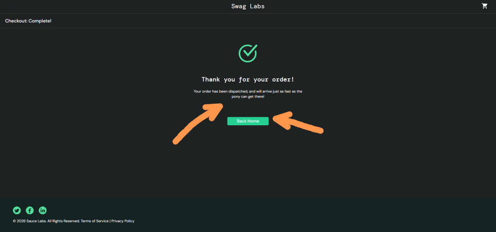
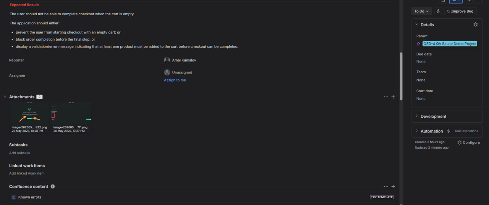

# Bug Report: User can complete checkout with an empty cart

**Bug ID:** BUG-003  
**Severity:** Major  
**Priority:** High  
**Type:** Functional bug  
**Related Test Case:** C308 — Verify checkout cannot be completed with an empty cart

## Summary
The application allows the user to complete the checkout process when the cart is empty.

After opening the Cart page with no products added, the user can click `Checkout`, enter valid checkout information, continue to the Checkout Overview page, and click `Finish`. The application then displays the order confirmation page even though no products were added to the cart.

## Environment
- **Application:** Sauce Demo
- **URL:** https://www.saucedemo.com/cart.html
- **Browser:** Google Chrome (latest version)
- **OS:** Windows 11
- **User:** `standard_user`

## Preconditions
- User is logged in as `standard_user`
- Cart is empty
- User is on the Cart page: https://www.saucedemo.com/cart.html

## Steps to Reproduce
1. Click the `Checkout` button
2. On the `Checkout: Your Information` page, enter valid checkout data:
   - First Name: `Harry`
   - Last Name: `Potter`
   - Zip / Postal Code: `12345`
3. Click the `Continue` button
4. On the `Checkout: Overview` page, click the `Finish` button

## Expected Result
The user should not be able to complete checkout when the cart is empty.

The application should either:
- prevent the user from starting checkout with an empty cart
- block order completion before the final step
- display a validation or error message indicating that at least one product must be added to the cart before checkout can be completed

## Actual Result
The user can complete the checkout process with an empty cart and reach the `Checkout Complete` page.

The application displays an order confirmation message even though no products were added to the cart.

## Notes
This creates an invalid checkout flow:
- the cart contains no products
- the user can still proceed through all checkout steps
- the application displays a successful order confirmation for an empty order

## Attachment
Add actual result screenshots here:

## Jira Evidence

**Jira Issue:** QSD-7  
**Status:** In Progress  
**Priority:** Medium  
**Parent:** QSD-4 — QA Sauce Demo Project

