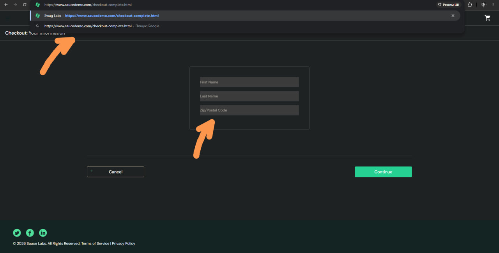
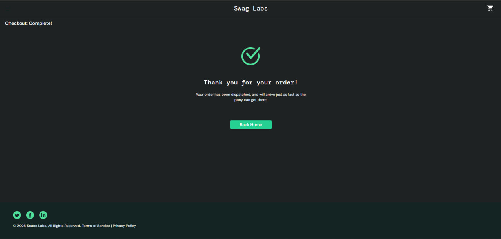
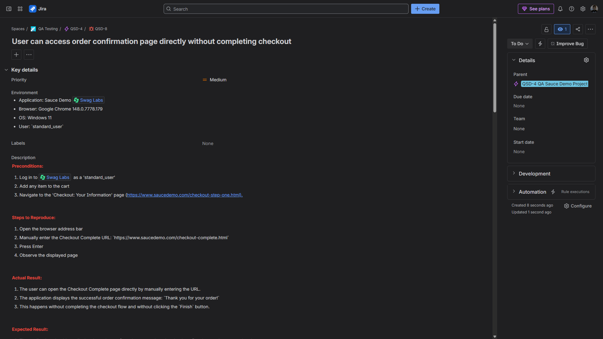
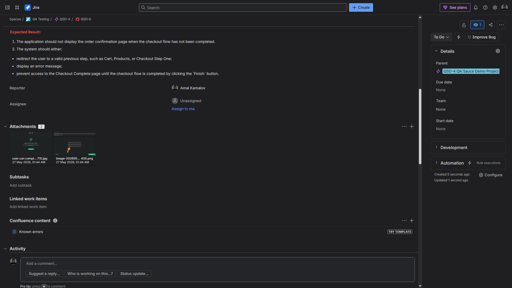

# Bug Report: User can access order confirmation page directly without completing checkout

**Bug ID:** BUG-004  
**Severity:** Major  
**Priority:** Medium  
**Type:** Functional bug  
**Related Test Case:** C300 — Direct URL Access to Checkout Complete Without Completed Order

## Summary
The application allows the user to access the order confirmation page directly by manually entering the Checkout Complete URL.

The user can open `https://www.saucedemo.com/checkout-complete.html` and see the successful order confirmation message without completing the checkout flow and without clicking the `Finish` button on the Checkout Overview page.

## Environment
- **Application:** Sauce Demo
- **URL:** https://www.saucedemo.com/checkout-complete.html
- **Browser:** Google Chrome (latest version)
- **OS:** Windows 11
- **User:** `standard_user`

## Preconditions
- User is logged in as `standard_user`
- Checkout flow has not been completed
- User has not clicked the `Finish` button on the Checkout Overview page

## Steps to Reproduce
1. Log in as `standard_user`
2. Open the browser address bar
3. Manually enter the Checkout Complete URL: `https://www.saucedemo.com/checkout-complete.html`
4. Press Enter
5. Observe the displayed page

## Expected Result
The application should not display the order confirmation page when the checkout flow has not been completed.

The system should either:
- redirect the user to a valid previous step, such as Cart, Products, or Checkout Step One
- display an error message
- prevent access to the Checkout Complete page until the checkout flow is completed by clicking the `Finish` button

## Actual Result
The user can open the Checkout Complete page directly by manually entering the URL.

The application displays the successful order confirmation message: `Thank you for your order!`

This happens without completing the checkout flow and without clicking the `Finish` button.

## Notes
This creates an invalid checkout flow:
- the user can access the final success page directly
- the checkout process can be bypassed
- the application displays an order confirmation state without completing the required checkout steps

## Attachment
Add actual result screenshots here:

## Jira Evidence

**Jira Issue:** QSD-8  
**Status:** In Progress  
**Priority:** Medium  
**Parent:** QSD-4 — QA Sauce Demo Project

