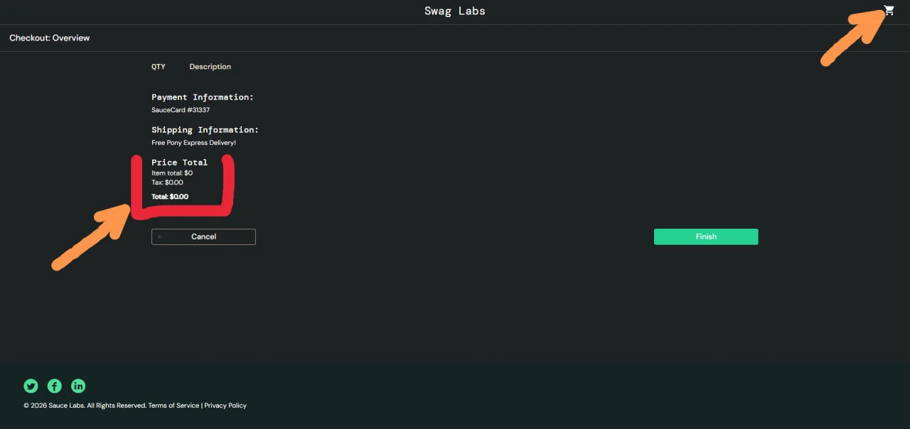
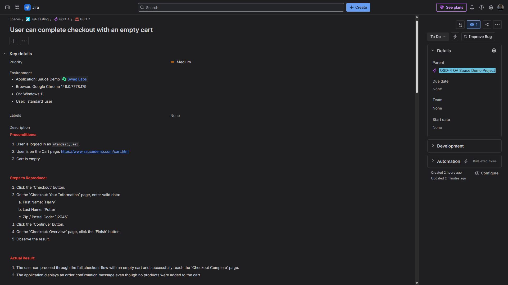

# BUG-003: User can complete checkout with an empty cart

- **Severity:** Major
- **Priority:** Medium
- **Type:** Functional bug
- **Related Test Case:** C308 Verify checkout cannot be completed with an empty cart
- **Jira Issue:** QSD-7

## Summary

The application allows the user to complete the full checkout flow even when no products are added to the cart.

A user can open the Cart page with an empty cart, proceed to Checkout, enter valid checkout information, and successfully reach the Checkout Complete page. This creates an illogical e-commerce flow because an order can be completed without any items.

## Environment

- **Application:** Sauce Demo
- **URL:** https://www.saucedemo.com
- **Browser:** Googdle Chrome 148.0.7778.179
- **OS:** Windows 11
- **User:** `standard_user`

## Preconditions

- User is logged in as `standard_user`
- Cart is empty
- User is on the Cart page: `https://www.saucedemo.com/cart.html`

## Steps to Reproduce

1. Click the `Checkout` button
2. On the `Checkout: Your Information` page, enter valid checkout data:
   - First Name: `Harry`
   - Last Name: `Potter`
   - Zip / Postal Code: `12345`
3. Click the `Continue` button
4. On the `Checkout: Overview` page, click the `Finish` button
5. Observe the result

## Expected Result

The user should not be able to complete checkout when the cart is empty.

The application should either:
- prevent the user from starting checkout with an empty cart;
- block order completion before the final step;
- display a validation/error message indicating that at least one product must be added to the cart before checkout can be completed.

## Actual Result

The user can proceed through the full checkout flow with an empty cart and successfully reach the `Checkout Complete` page.

The application displays an order confirmation message even though no products were added to the cart.

## Notes

This is a checkout flow logic issue. Sauce Demo does not provide real payment processing or order history, so the issue is reported based on the visible application behavior: checkout can be completed with an empty cart.

## Attachment

Add actual result screenshots here:

```md



```

## Jira Evidence

Add Jira screenshots here:

```md



```
